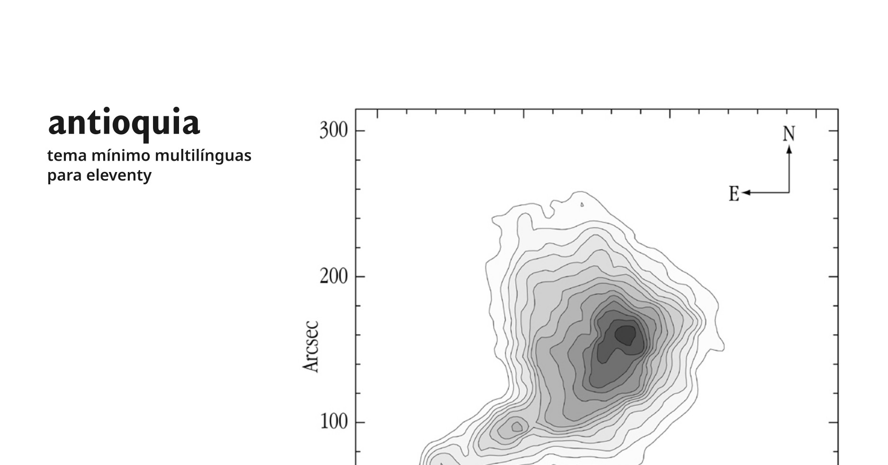

# antioquia

esqueleto de um template multi-línguas para [eleventy](https://www.11ty.dev/). 
_multilingual skeleton template for [eleventy](https://www.11ty.dev/)._

## motivos / _motives_

por pura diversão. 
_for fun._

falando sério, queria começar a entender como os templates no eleventy funcionam, então decidi fazer um mini-template.  
on a serious note, I wanted to understand how the templates for eleventy works, so I decided to create a mini-template to try on.

## instalação / _installation_

[Crie um _fork_](#) ou use [degit](https://github.com/Rich-Harris/degit) para criar uma cópia limpa do projeto. 
_[Fork it](#) or use [degit](https://github.com/Rich-Harris/degit) to create a clean copy from it._

### usando degit / _using degit_

Instale 
_install_ 
`npm install -g degit`

Crie uma cópia 
_create a copy_ 
`degit wesleyemw/antioquia`

## inspiração / _inspiration_

eleventy-i18n por / _by_ [lene saile](https://github.com/madrilene) - https://github.com/madrilene/eleventy-i18n 
elva por / _by_ [scott evans](https://github.com/scottsweb) - https://github.com/scottsweb/elva 
polyglot tech blog por / _by_ [Florent Tassy](https://gitlab.com/florent_tassy) - https://gitlab.com/florent_tassy/polyglot-tech-blog 
11ty Netlify Jumpstart por / _by_ [Stephanie Eckles](https://github.com/5t3ph) - https://github.com/5t3ph/11ty-netlify-jumpstart
